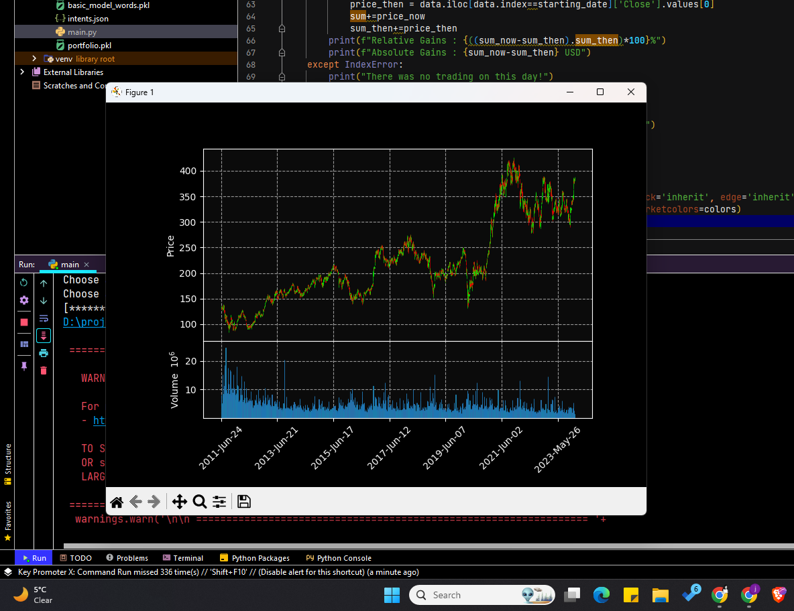

# Financial AI Assistant

## Overview
This project implements a Financial AI Chatbot that assists users with stock-related queries, portfolio management, and stock chart analysis. The chatbot is powered by a neural network model using the Neural Intents library.

## Features
- **Stock Portfolio Management:**
  - Add stocks to your portfolio.
  - Remove stocks from your portfolio.
  - View and display your current stock portfolio.
  - Calculate the worth of your portfolio.

- **Stock Chart Analysis:**
  - Plot candlestick charts for stock symbols.
  - Choose a starting date for historical stock chart analysis.

- **Portfolio Gains Analysis:**
  - Analyze relative and absolute gains of your portfolio.
  - Compare portfolio performance for a specified date.

- **Interactive Conversations:**
  - Engage in interactive conversations with the chatbot.

## Technologies Used
- Python
- Neural Intents Library
- TensorFlow/Keras
- pandas, pandas_datareader, matplotlib, mplfinance
- Streamlit (for interactive web application, if applicable)

## Screenshots

*Candlestick chart of a Stock*

*Worth of User's Portfolio*

*Summary of User's Portfolio*

*Performance/Gains of User's Portfolio*

## Usage

- Launch the chatbot by running the `main.py` script.
- Follow the prompts to interact with the chatbot.
- Use commands for `plot_chart`, `add_portfolio`, `remove_portfolio`, `show_portfolio`, `portfolio_worth`, `portfolio_gains`, `bye`, etc.

## Contributors
- Jyotsna @jyotsnad246

## Acknowledgments
- Thanks to the creators of the Neural Intents library.
- Inspired by financial chatbot projects in the open source community.
  
